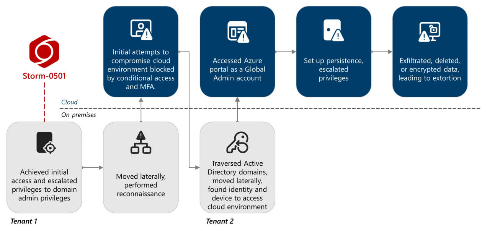

Week 4 – Cyber Kill Chain Mapping
---------------------------------

### Reference Campaign

**Storm-0501** (MITRE ATT&CK Group ID: G1053)

### Quick Overview

Storm-0501 is a financially motivated threat actor that has evolved from traditional ransomware operations into hybrid cloud attacks, pivoting from compromised on-premises Active Directory environments into Microsoft Entra ID to achieve persistent access and deploy ransomware across both on-prem and cloud infrastructure

*Source: Microsoft Threat Intelligence, "Storm-0501's evolving techniques lead to cloud-based ransomware" (Aug 2025)*
### Cyber Kill Chain

The Cyber Kill Chain is the framework that breaks down a cyberattack into sequential phases to identify threats. The seven phases are: Reconnaissance, Weaponization, Delivery, Exploitation, Installation, Command & Control, and Actions on Objectives.

### Kill Chain Mapping

| Kill Chain Stage | Campaign Activity | ATT&CK Techniques | Description |
| --- | --- | --- | --- |
| **Reconnaissance** | _Not directly observed for Storm-0501 itself._ | NONE | Microsoft's reporting indicates initial footholds were obtained through initial access brokers (Storm-0249, Storm-0900) in earlier campaigns; target scanning/selection was effectively outsourced rather than performed by Storm-0501 directly. |
| **Weaponization** | Acquisition of tooling used across the campaign. | T1650 (Acquire Access), T1588.001/.002 (Obtain Capabilities: Malware / Tool) | Storm-0501 acquired and prepared its toolset ahead of deployment, including AADInternals (Entra ID manipulation), AzureHound (Azure attack-path mapping), and Evil-WinRM (post-exploitation remote execution). |
| **Delivery** | Initial access into the on-premises environment. | T1190 (Exploit Public-Facing Application), T1078 (Valid Accounts) | Initial access was achieved by exploiting known vulnerabilities in unpatched public-facing servers (Zoho ManageEngine CVE-2022-47966, Citrix NetScaler CVE-2023-4966, ColdFusion CVE-2023-29300/38203) or by authenticating with previously compromised credentials. |
| **Exploitation** | Execution of malicious commands and crafted authentication artifacts. | T1059 (Command and Scripting Interpreter), T1606 (Forge Web Credentials) | The threat actor executed commands via compromised sessions (including suspicious AADInternals cmdlets) and crafted SAML tokens to impersonate users once cloud access was achieved. |
| **Installation** | Establishment of durable access. | T1484.002 (Domain Trust Modification), T1556 (Modify Authentication Process) | Storm-0501 registered a threat-actor-owned Entra ID tenant as a trusted federated domain, creating a backdoor that allowed sign-in as nearly any user via forged SAML tokens. A new MFA method was also registered on a compromised account lacking existing MFA, ensuring the actor could satisfy Conditional Access requirements going forward. |
| **Command & Control** | Remote access and tooling used to interact with compromised systems. | T1219 (Remote Access Software) | Remote monitoring and management tools (Level.io, AnyDesk, NinjaOne) were used in earlier campaigns to interact with and maintain access to compromised devices. |
| **Actions on Objectives** | Discovery, credential theft, privilege escalation, lateral movement, defense evasion, exfiltration, and impact — the full post-foothold campaign. | T1082 (System Information Discovery), T1087.002 (Domain Account), T1482 (Domain Trust Discovery), T1069.002 (Domain Groups), T1018 (Remote System Discovery), T1580 (Cloud Infrastructure Discovery); T1003.006 (DCSync), T1552.001/.004 (Credentials in Files / Private Keys), T1528 (Steal Application Access Token); T1021.006 (Remote Services: WinRM); T1562.001 (Disable or Modify Tools – Defender for Endpoint checks via `sc query`); T1098.001/.003 (Account Manipulation), T1484.001 (Group Policy Modification); T1537 (Transfer Data to Cloud Account), T1567.002 (Exfiltration to Cloud Storage); T1485 (Data Destruction), T1486 (Data Encrypted for Impact), T1490 (Inhibit System Recovery), T1657 (Financial Theft) | This is the core of Storm-0501's campaign. On-premises: discovery via `net.exe`, `nltest.exe`, `quser.exe`, `systeminfo.exe`, and checks for Defender for Endpoint (`sc query sense`, `sc query windefend`); lateral movement via Evil-WinRM; credential theft via DCSync and Entra Connect Sync account extraction. In the cloud: AzureHound-driven discovery of critical assets; privilege escalation to Global Administrator and Azure Owner roles; exfiltration of Azure Storage data via AzCopy; and impact through mass deletion of storage accounts, snapshots, and backups, or encryption via a threat-actor-created Key Vault --  ultimately leading to extortion via compromised Microsoft Teams accounts. |

### Notes

*   Storm-0501's attempts to compromise the cloud environment directly were initially **blocked by Conditional Access policies and MFA** - the actor only succeeded after resetting the password of a non-human synced identity that had Global Administrator privileges but no registered MFA method, then registering their own MFA method on that account. This is a notable defensive near-success worth highlighting.
*   The **Reconnaissance** phase is intentionally left without ATT&CK technique references, consistent with Microsoft's own reporting that Storm-0501's footholds originate from access brokers rather than the group's own target research.
*   Several ATT&CK tactics (Discovery, Credential Access, Lateral Movement, Privilege Escalation, Defense Evasion, Exfiltration, Impact) are grouped under Actions on Objectives, since the Lockheed Martin model does not define separate phases for them - see the note above for reasoning.
*   The August 2025 campaign shows a clear evolution from the September 2024 campaign: the group has moved away from deploying on-premises ransomware binaries entirely, instead using only native Azure API operations (storage account deletion, snapshot deletion, Key Vault-based encryption) to achieve the same extortion outcome - this is a significant detail for discussing how the group's tradecraft has matured.

### Sources

*   MITRE ATT&CK, "Storm-0501, Group G1053". [https://attack.mitre.org/groups/G1053/](https://attack.mitre.org/groups/G1053/)
*   Microsoft Threat Intelligence, _"Storm-0501: Ransomware attacks expanding to hybrid cloud environments"_ (Sept 26, 2024). [https://www.microsoft.com/en-us/security/blog/2024/09/26/storm-0501-ransomware-attacks-expanding-to-hybrid-cloud-environments/](https://www.microsoft.com/en-us/security/blog/2024/09/26/storm-0501-ransomware-attacks-expanding-to-hybrid-cloud-environments/)
*   Microsoft Threat Intelligence, _"Storm-0501's evolving techniques lead to cloud-based ransomware"_ (Aug 27, 2025). [https://www.microsoft.com/en-us/security/blog/2025/08/27/storm-0501s-evolving-techniques-lead-to-cloud-based-ransomware/](https://www.microsoft.com/en-us/security/blog/2025/08/27/storm-0501s-evolving-techniques-lead-to-cloud-based-ransomware/)
