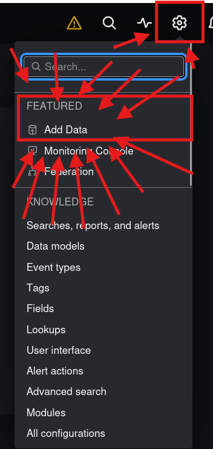
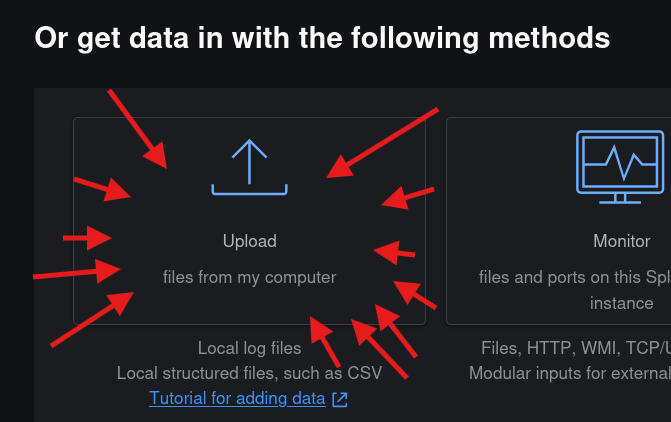
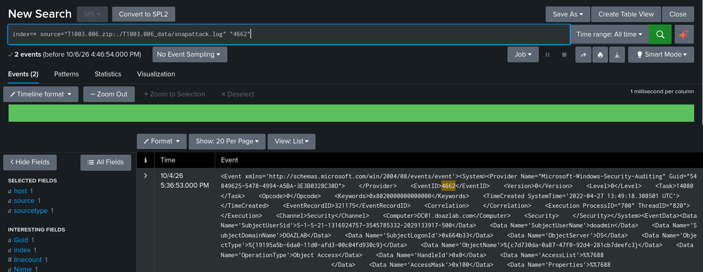

# week5

## Week 5 – Hypothesis-driven hunting scenario

### Introduction

This week applies hypothesis-driven threat hunting to the project's ongoing Active Directory threat hunting focus, using two techniques documented in Storm-0501's campaign (see Week 4): **T1484.001 (Group Policy Modification)** and **T1003.006 (DCSync)**

Both techniques were chosen because they represent two different stages of the same realistic attack path: an attacker first steals credentials via DCSync, then uses the resulting Domain Admin-level access to abuse Group Policy for domain-wide impact (e.g. ransomware deployment, as Storm-0501 does).

### Techniques

#### T1484.001 – Group Policy Modification

Adversaries may modify Group Policy Objects (GPOs) to subvert the intended discretionary access controls for a domain, usually with the intention of escalating privileges on the domain. Group policy allows for centralized management of user and computer settings in Active Directory (AD). GPOs are containers for group policy settings made up of files stored within a predictable network path `\\\\<DOMAIN>\\\\SYSVOL\\\\<DOMAIN>\\\\Policies\\\\`.

Like other objects in AD, GPOs have access controls associated with them. By default all user accounts in the domain have permission to read GPOs. It is possible to delegate GPO access control permissions, e.g. write access, to specific users or groups in the domain.

[Text from this link](https://attack.mitre.org/techniques/T1484/001/)

#### T1003.006 – DCSync

Adversaries may attempt to access credentials and other sensitive information by abusing a Windows Domain Controller's application programming interface (API) to simulate the replication process from a remote domain controller using a technique called DCSync.

Members of the Administrators, Domain Admins, and Enterprise Admin groups or computer accounts on the domain controller are able to run DCSync to pull password data from Active Directory, which may include current and historical hashes of potentially useful accounts such as `KRBTGT` and Administrators. The hashes can then in turn be used to create a `Golden Ticket` for use in `Pass The Ticket` or change an account's password

[Text from this link](https://attack.mitre.org/techniques/T1003/006/)

### Attack Scenario

**Hypothesis 1 (DCSync):** An attacker who has compromised a privileged account is abusing directory replication rights to extract password hashes directly from a Domain Controller, bypassing the need to interactively log on to the DC itself.

* **Why this matters:** DCSync does not require code execution on the DC – only an account holding (or granted) `Replicating Directory Changes` and `Replicating Directory Changes All` extended rights. This makes it a stealthy, low-footprint credential theft method favored by real-world actors including Storm-0501.

**Hypothesis 2 (GPO Modification):** An attacker with Domain Admin-level access is creating or modifying a Group Policy Object to push a malicious script, scheduled task, or configuration change domain-wide.

* **Why this matters:** GPOs apply automatically to every linked computer and user object, making them an efficient way for an attacker to achieve mass deployment (e.g. ransomware) without needing to touch each host individually. Storm-0501 is documented using GPO abuse for exactly this purpose.

### Lab Environment

```text-plain
sudo docker ps 
CONTAINER ID   IMAGE                  COMMAND                  CREATED        STATUS                   PORTS                                                                                                                                        NAMES
dab1ce5de075   splunk/splunk:latest   "/sbin/entrypoint.sh…"   46 hours ago   Up 5 minutes (healthy)   8065/tcp, 0.0.0.0:8000->8000/tcp, \\\[::]:8000->8000/tcp, 8088/tcp, 8191/tcp, 9887/tcp, 0.0.0.0:8089->8089/tcp, \\\[::]:8089->8089/tcp, 9997/tcp   splunk
```

|||
|-|-|
|Component|Details|
|Platform|Docker (`splunk/splunk:latest` image)|
|Dataset source|github.com/splunk/attack\_data|
|Datasets pulled|`datasets/attack\\\_techniques/T1003.006/` (full folder – `impacket`, `mimikatz`, `snapattack` subfolders), `datasets/attack\\\_techniques/T1484.001/` (full folder – 6 subfolders)|
|Index|`attack\\\_data`|
|Sourcetype|`XmlWinEventLog:Security`|

### Dataset Ingestion

How was data uploaded to splonk

1\. At the dashboard navigate to that cog(settings) and click on `Add Data`



2\. Clicking on this 



3\. Selecting file


2 zip files were uploaded, since all those logs have the source type:

```text-plain
unzip -l T1003.006.zip
Archive:  T1003.006.zip
  Length      Date    Time    Name
---------  ---------- -----   ----
        0  2026-10-06 11:31   T1003.006\\\_data/
      913  2026-10-05 10:19   T1003.006\\\_data/windows-directory\\\_service.log
     2992  2026-10-04 13:36   T1003.006\\\_data/snapattack.log
    16106  2026-10-05 10:19   T1003.006\\\_data/xml-windows-security.log
     4956  2026-10-05 10:19   T1003.006\\\_data/windows-security.log
      248  2026-10-05 10:19   T1003.006\\\_data/zeek-dce\\\_rpc.log
    10491  2026-10-04 13:37   T1003.006\\\_data/windows-security-xml.log
---------                     -------
    35706                     7 files
```

```text-plain
unzip -l T1484.001.zip                                             
Archive:  T1484.001.zip
  Length      Date    Time    Name
---------  ---------- -----   ----
        0  2026-10-06 11:31   T1484.001\\\_data/
    32549  2026-10-06 10:27   T1484.001\\\_data/security-4688.log
    11949  2026-10-06 10:28   T1484.001\\\_data/snapattack.log
     2559  2026-10-06 10:27   T1484.001\\\_data/windows-admon.log
    10001  2026-10-06 10:27   T1484.001\\\_data/windows-security.log
---------                     -------
    57058                     5 files
```

### Executing queries

#### T1484.001

executed query:

```text-plain
index=\\\* source="t1484.001.zip:./t1484.001\\\_data/\\\*" host="227f9c407156" "5145"
```


#### T1003.006

executed query:

```text-plain
index=\\\* source="T1003.006.zip:./T1003.006\\\_data/snapattack.log" "4662"
```



